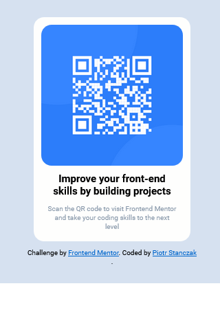
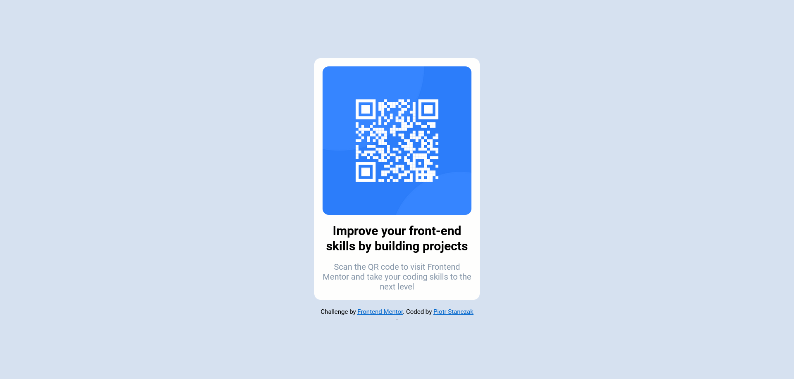

# Frontend Mentor - QR code component solution

This is a solution to the [QR code component challenge on Frontend Mentor](https://www.frontendmentor.io/challenges/qr-code-component-iux_sIO_H). Frontend Mentor challenges help you improve your coding skills by building realistic projects. Netlify: https://63eb6027bf5041049f968c90--darling-profiterole-0d916a.netlify.app/

## Table of contents

- [Overview](#overview)
  - [Screenshot](#screenshot)
- [My process](#my-process)
  - [Built with](#built-with)
  - [What I learned](#what-i-learned)
- [Author](#author)
- [Acknowledgments](#acknowledgments)

## Overview

### Screenshot

## My process

### Built with

- Semantic HTML5 markup
- SASS (SCSS)
- Flexbox
- BEM
- Mobile-first workflow

### What I learned

I learned to use the BEM methodology in practice. I remembered the rules for using Flexbox

## Author

- Frontend Mentor - [@piotrstanczak94](https://www.frontendmentor.io/profile/piotrstanczak94)
- LinkedIn - [@piotr-andrzej-stanczak](https://www.linkedin.com/in/piotr-andrzej-stanczak/)

## Acknowledgments

Special thanks to Majek (https://mmcschool.pl/). His frontend courses were very helpful.
